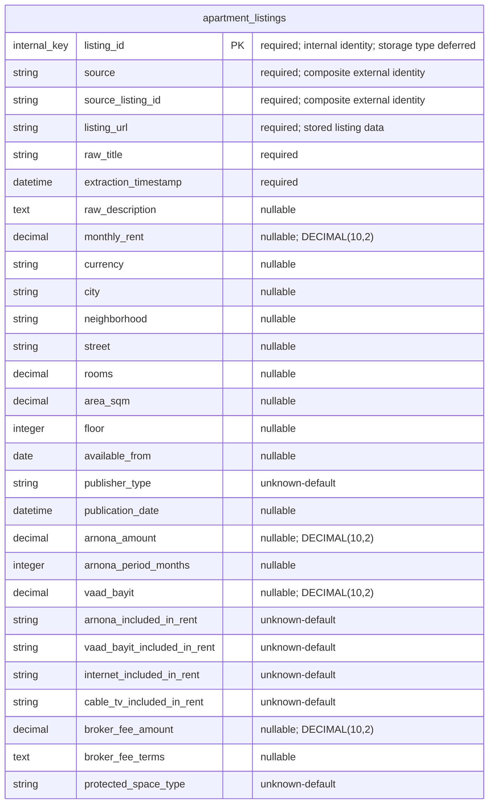

# Phase 1 Apartment Listing Persistence Design

## Purpose

Define the Phase 1 database persistence design for normalized apartment
listings before database tables, ORM models, or save/retrieve logic are
implemented.

This document describes the approved persistence shape only. It does not
create a schema, configure SQLAlchemy, or change the Python domain model.

## Scope

Phase 1 persistence stores exactly one entity:

- `apartment_listings`

The entity stores the latest known state of each listing from an external
source. It does not store listing history, price history, source records,
broker records, photo records, canonical-property records, or deduplication
records.

## Phase 1 ERD

Phase 1 has one persistence entity only, so there are no inter-entity
relationships and no relationship cardinalities.

## Identity And Uniqueness

`listing_id` is the required persistence-only primary key. It identifies a
stored record inside this system and is not part of the current
`ApartmentListing` domain model. The concrete MySQL storage type for
`listing_id` is deferred until schema implementation is approved.

The external listing identity is the pair `(source, source_listing_id)`. This
pair must be unique in `apartment_listings`.

Neither `source` nor `source_listing_id` is globally unique by itself. The
uniqueness rule applies only to the composite pair.

`listing_url` is stored listing data. It is not the durable uniqueness key.

The listing source is stored directly on the listing row. Phase 1 does not
create a separate source entity or table.

## Current Domain Fields

These fields already exist in `src/domain/listing.py` and map into the
`apartment_listings` persistence entity.

| Field | Phase 1 persistence behavior |
| --- | --- |
| `source` | Required; part of the unique external identity. |
| `source_listing_id` | Required; part of the unique external identity. |
| `listing_url` | Required stored listing data; not the uniqueness key. |
| `raw_title` | Required stored listing title. |
| `extraction_timestamp` | Required collection timestamp. |
| `raw_description` | Nullable when unavailable. |
| `monthly_rent` | Nullable `DECIMAL(10,2)`; missing rent remains NULL, never zero. |
| `currency` | Nullable currency value stored separately from money amounts. |
| `city` | Nullable when unavailable. |
| `neighborhood` | Nullable when unavailable. |
| `street` | Nullable when unavailable. |
| `rooms` | Nullable when unavailable. |
| `area_sqm` | Nullable when unavailable. |
| `floor` | Nullable when unavailable. |
| `available_from` | Nullable when unavailable. |
| `publisher_type` | Non-NULL in intent; allowed values are `owner`, `broker`, and `unknown`; missing publisher information is stored as `unknown`. |
| `publication_date` | Nullable when unavailable. |

## Owner-Approved Persistence Fields Not Yet In Python

These fields are approved for Phase 1 persistence but are not yet implemented
in the current Python `ApartmentListing` domain model.

| Field | Phase 1 persistence behavior |
| --- | --- |
| `arnona_amount` | Nullable `DECIMAL(10,2)`; missing arnona amount remains NULL. |
| `arnona_period_months` | Nullable integer count of months covered by `arnona_amount`; `1` means monthly, `2` means two months, NULL means unknown. |
| `vaad_bayit` | Nullable `DECIMAL(10,2)` for building committee payment. |
| `arnona_included_in_rent` | Non-NULL in intent; one of `included`, `not_included`, or `unknown`. |
| `vaad_bayit_included_in_rent` | Non-NULL in intent; one of `included`, `not_included`, or `unknown`. |
| `internet_included_in_rent` | Non-NULL in intent; one of `included`, `not_included`, or `unknown`. |
| `cable_tv_included_in_rent` | Non-NULL in intent; one of `included`, `not_included`, or `unknown`. |
| `broker_fee_amount` | Nullable `DECIMAL(10,2)` one-time broker payment when a clear amount is known. |
| `broker_fee_terms` | Nullable free text for broker-fee payment conditions. |
| `protected_space_type` | Non-NULL in intent; one of `mamad`, `mamak`, `miklat`, `public_shelter`, `none`, or `unknown`. |

## Money And Cost Representation

All persisted Phase 1 money fields use MySQL `DECIMAL(10,2)`:

- `monthly_rent`
- `arnona_amount`
- `vaad_bayit`
- `broker_fee_amount`

Currency remains separate in `currency`.

Unknown money values remain NULL and must never be stored as zero.

Nullable textual information that is unavailable is represented as NULL. An
empty string must not be used as the representation of unknown information.

`monthly_rent` stores the advertised monthly rent. `arnona_amount` stores the
known arnona amount, and `arnona_period_months` records how many months that
amount covers. `vaad_bayit` stores the building committee payment.

Phase 1 does not add `management_fee` or a generic
`other_mandatory_costs` field.

## Included-In-Rent Status

The included-in-rent fields track whether specific costs are included in the
advertised rent:

- `arnona_included_in_rent`
- `vaad_bayit_included_in_rent`
- `internet_included_in_rent`
- `cable_tv_included_in_rent`

Each field uses exactly:

- `included`
- `not_included`
- `unknown`

`included` means the listing explicitly states the cost is included in the
advertised rent. `not_included` means the listing explicitly states the cost
is paid separately. `unknown` means the listing does not provide enough
information.

Missing inclusion information must remain `unknown` and must never be
interpreted as `not_included`.

## Publisher And Broker Fees

`publisher_type` is the canonical field for publisher classification. Allowed
values are `owner`, `broker`, and `unknown`.

Missing publisher information is stored as `unknown`, not NULL, and must never
be treated as an owner listing.

Broker listings remain normal `apartment_listings` rows with
`publisher_type = broker`. Phase 1 does not create a separate broker entity.

`broker_fee_amount` stores a one-time broker payment only when a clear
monetary amount can be determined. It must not be inferred automatically from
`monthly_rent`; the system must not assume a broker fee equals one month of
rent unless the listing supports that conclusion.

`broker_fee_terms` preserves free-text payment conditions, such as one month
of rent, one month plus VAT, payment on contract signing, or payment before
move-in.

Broker fees are one-time costs and must not be mixed into advertised monthly
rent.

## Protected Space

`protected_space_type` represents protected-space availability. Allowed values
are:

- `mamad`
- `mamak`
- `miklat`
- `public_shelter`
- `none`
- `unknown`

When protected-space information is unavailable, store `unknown`.

## Photo Eligibility

Photo availability is an ingestion precondition, not persisted listing data.

Only listings confirmed to contain at least one photo continue to
normalization and persistence. Listings without photos, or with unknown photo
availability, are excluded before persistence.

Phase 1 does not persist photo-availability flags, image URLs, or image files.

## Repeat Collection Behavior

Phase 1 stores only the latest known state of each external listing. When the
same `(source, source_listing_id)` appears again, persistence should update
the existing row instead of inserting a second row.

Phase 1 does not preserve price history or listing history.

## Domain And Persistence Boundary

The `ApartmentListing` model is the current Python domain contract for
normalized listing data. The persistence design defines how approved listing
information will be stored in MySQL later.

The persistence record includes `listing_id`, which is database identity and
does not belong to the current domain object. Some Owner-approved persistence
fields are documented here before they are implemented in the Python domain
model.

Future save and retrieve operations should map between domain objects and
database records without making database identifiers part of source listing
identity.

## Excluded From Phase 1 Persistence

Phase 1 intentionally does not persist:

- `estimated_total_monthly_cost`
- price history
- listing history
- source entities
- broker entities
- photo entities
- canonical-property entities
- deduplication entities
- photo-availability flags
- image URLs
- image files
- electricity, water, and gas as listing-defined recurring cost fields
- user-specific electricity, water, and gas estimates

Internet and cable TV are not excluded generally; their included-in-rent
status is persisted through the approved inclusion-status fields.

The system may later calculate estimated monthly cost during processing or
display, but Phase 1 must use only known information, avoid double-counting
costs already included in rent, and leave the estimate unavailable when the
available information is insufficient.

## Assumptions And Limitations

- This is a design document only.
- No physical MySQL schema, SQLAlchemy model, or persistence code is created
  by this issue.
- The design assumes MySQL as the planned database.
- The design covers Phase 1 latest-state listing persistence only.
- Future history, deduplication, canonical-property, scoring, and display
  capabilities require separate approved issues.
